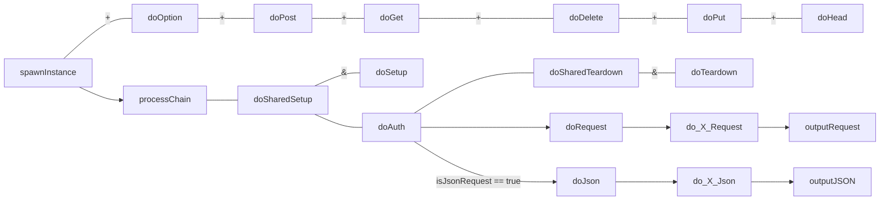

#Servlet

##Classes

###CorePage

JavaCommons.servlet page core system, in which all additional pages are extended from. In addition, this is intentionally structured to be “usable” even without the understanding / importing of the various HttpServlet functionalities. Though doing so is still highly recommended.

corePage, and its sub page is designed to facilitate rapid servlet page creation, and extension across 3 distinct processing layers/roles : Authentication, Data, and output.

In addition, it has built in mechanism to facilitate the handling of JSON data request

Note that internally, doPost, doGet creates a new class instance for each call/request it receives. As such, all subclass built can consider all servlet instances are fresh instances on process request.

CorePage request process flow



Corepage lifecycle process flow

```flow
lcp1a=>operation: contextInitialized
lcp2a=>operation: doSharedSetup
lcp3a=>operation: initializeContext

lcp1a(right)->lcp2a(right)->lcp3a
```
```flow
lcp1b=>operation: contextDestroyed
lcp2b=>operation: doSharedTeardown
lcp3b=>operation: destroyContext

lcp1b(right)->lcp2b(right)->lcp3b
```


**Constructor**

+ CorePage()

**Methods Summary**

+ contextDestroyed(), contextInitialized(), destroyContext(), doAuth(), doDelete(), doDeleteJSON(), doDeleteRequest(), doException(), doGet(), doGetJSON(),
doGetRequest(), doJSON(), doOptions(), doPost(), doPostJSON(), doPostRequest(), doRequest(), doSetup(), doSharedSetup(), doSharedTeardown(), doTeardown(),
getContextPath(), getContextURI(), getHttpServletRequest(), getHttpServletResponse(), getOutputStream(), getParameter(), getServletContextURI(), getWriter(),
initializeContext(), initSetup(), isDELETE(), isGET(), isJsonRequest(), isOPTION(), isPOST(), isPUT(), outputFileServlet(), outputJSON(), outputJSONException(),
outputRequest(), outputRequestException(), processChain(), requestCookieMap(), requestHeaderMap(), requestParameters(), requestServletPath(), requestType(),
requestURI(), requestWildcardUri(), requestWildcardUriArray(), sendRedirect(), spawnInstance()




####CorePageAPI

Extends the core API page, to support APIs.


**Constructor**

+ CoreApiPage()

**Methods Summary**

+ apiBuilder(), apiBuilderSetup(), fileConfig(), getClassPath(), getConfigPath(), getLibraryPath(), getWebInfPath(), isJsonRequest(), outputJSON()




####RequestFileArray

Class map, that handles file uploads in a RequestList.


**Constructor**

+ RequestFileArray()

**Methods Summary**

+ get(), getByteArray(), getFileItem(), getInputStream(), getName(), iterator(), listIterator(), writeToFile()




####RequestMap

Class map, that handles the request map, and does the conversion between request arrays, and request values.

Also implements the generic convert class.


**Constructor**

+ RequestMap()
+ RequestMap(javax.servlet.http.HttpServletRequest req)
+ RequestMap(java.util.Map<java.lang.String,java.lang.Object> proxy)




##ServletApi

###Interfaces

####ApiFunction

Convenience class, which makes it easier to type drop in replacement for “BiFunction<ApiRequest, ApiResponse, ApiResponse>”. Note that it is intentionally not a requirement to use this class for the ApiBuilder functionality, as we wanted to maintain the standards compatibility.

###Classes

####ApiBuilder

ApiBuilder is the toolbox for the building of modern JSON pure APIs as well as executing the implementation of API endpoints defined.

This can be used in the project either via a public API, or even internally via a direct function call.

The main functionalities of the ApiBuilder are as followed:

+ Packaging the entire web project core functionalities
+ JS Api script generation
+ Swagger compliant API documentation generation
+ RAML compliant API documentation generation
+ Internal function calls

Although Picoded does not follow the conventional way of how a RESTful API is being implemented, the API that is generated favors JSON objects. All of the endpoints would take in JSON objects as their parameters. Honestly speaking, you have your rights in your own opinions but Picoded as a company does deal with quite a number of enterprise companies who for “security reasons” block off HTTP commands such as PUT / DELETE, as such our API in most cases end up not being purely “RESTful” With GET commands modifying things, and POST commands deleting things. ApiBuilder treats all commands equally without discriminations.

Major, Minor semantic versioning support

See: http://semver.org/

Apart from that, the ApiBuilder allows major and minor versioning of API endpoints but patch is intentionally not supported as it adds too much development overhead.

See why REST on API’s is problematic here : https://mmikowski.github.io/the_lie/



**Historic notes from JavaCommons.RESTBuilder**

While, it replaces the original servlet framework role of creating JSON API’s. The framework is also meant to facilitate intra project function calls. One of the examples learnt from the LMS project, in handling the encryption of export files (for example). Is that instead of rewriting the entire export module code to be “callable” by a function a rather indirect and “inefficient” method of calling its local page directly was used. Aka an encryption proxy. Due to the time constraints of the project.

Simply put, if a standardized API builder was built and used, several page API features can be called directly instead of being used via a proxy


Moving on, the JS Api script generation functionality is of course to generate a Javascript script that would allow you to call the endpoints similar to calling functions in Java.

Swagger and RAML integration is meant to be used for generating documentation more efficiently and effectively for programmers.



**Constructor**

+ ApiBuilder()

**Methods Summary**

+ endpoint(), execute(), filter(), get(), isValidPath(), keySet(), put(), remove(), servletExecute(), setVersion(), version(), versionStr()




####ApiRequest

API Request map information For the API function to process.


**Methods Summary**

+ context(), get(), getHttpServletRequest(), keySet(), put(), query(), remove()





####ApiResponse

API Request map information For the API function to process.


**Methods Summary**

+ getHttpServletRequest()




####ApiVersionSet

Represents the various different function / filter maps specified specifically for a single version.


**Constructor**

+ ApiVersionSet()




###Exceptions

####HaltException


**Constructor**

+ HaltException()



###Modules

####ApiModule
The ApiModule template.


**Methods Summary**

+ setupApiBuilder()




####Account Modules

#####Account_strings


**Fields Summary**

+ ERROR_(DEFAULT, FAILED_LOGIN, INVALID_FORMAT_JSON, NO_GROUP, NO_GROUP_ID, NO_GROUPNAME, NO_LOGIN_ID, NO_LOGIN_PASSWORD, NO_META, NO_NEW_PASSWORD, NO_NEW_REPEAT_PASSWORD, NO_PASSWORD, NO_PRIVILEGES, NO_ROLE, NO_USER, NO_USER_ID, NO_USERNAME, NOT_GROUP, NOT_IN_GROUP_OR_ROLE, PASS_INCORRECT, PASS_NOT_EQUAL)
+ GROUP
+ REQ_(ACCOUNT_ID, ACCOUNT_NAME, ADD_LIST, DEFAULT_ROLES, GROUP_ID, GROUPNAME, HEADERS, IS_GROUP, META, NEW_PASSWORD, OID, OLD_PASSWORD, PASSWORD, REMEMBER_ME, REMOVE_LIST, REPEAT_PASSWORD, ROLE, SANITISE_OUTPUT, UPDATE_MODE, USER_ID, USERNAME)
+ RES_(ACCOUNT_ID, DATA, DRAW, ERROR, FAIL_ADD, FAIL_REMOVE, GROUP_ID, HEADERS, IS_LOGIN, LIST, LOGIN_ID_LIST, META, RECORDS_FILTERED, RECORDS_TOTAL, REMEMBER_ME, RETURN, SINGLE_RETURN_VALUE, SUCCESS, SUCCESS_ADD, SUCCESS_REMOVE, UPDATE_MODE)
+ SPACE

**Constructor**

+ Account_Strings()



#####AccountFilterApi

Account table filter.


**Fields Summary**

+ MISSING_REQUEST_PAGE

**Constructor**

+ AccountFilterApi()

**Methods Summary**

+ setupApiBuilder()



#####AccountTableApi

Account table API builder.


**Fields Summary**

+ MISSING_REQUEST_PAGE
+ new_account

**Constructor**

+ AccountTableApi()

**Methods Summary**

+ setupApiBuilder()




####Utility Modules

#####EchoApi

Provides a basic API template to echo back ALL request parameter.


**Fields Summary**

+ SimpleEcho

**Constructor**

+ EchoApi()




##Servlet Utilities

###EmbeddedServlet

EmbeddedServlet class, provides a means of self executing any of the JavaCommons packages without having the need of a parent tomcat.

On the flip side, this assumes only 1 context per deployment. For more complex deployments, use tomcat (or its many siblings).


**Constructor**

+ EmbeddedServlet()

**Methods Summary**

+ await(), close(), main()



###FileServlet

A simple implementation of a file server in java, which supports the following

+ Client side file Caching
+ GZIP of data


**Example Usage**

<b>If used directly in WEB.xml</b>

	<servlet>
	    <servlet-name>fileServlet</servlet-name>
	    <servlet-class>picoded.servletUtils.FileServlet</servlet-class>
	    <init-param>
	        <param-name>basePath</param-name>
	        <param-value>/path/to/files</param-value>
	    </init-param>
	</servlet>

	<servlet-mapping>
	    <servlet-name>fileServlet</servlet-name>
	    <url-pattern>/files/*</url-pattern>
	</servlet-mapping>

<b>If used directly inside another servlet</b>

	(new FileServlet("/path/to/files/")).processRequest(servletRequest,
		servletResponse);




**Fields Summary**

+ baseFolder, basePath, cacheNetworkJitterTolerance, fileExpireTime, gzipBufferSize

**Constructor**

+ fileServlet()

**Methods Summary**

+ init(), processRequest(), validateBasePath()


