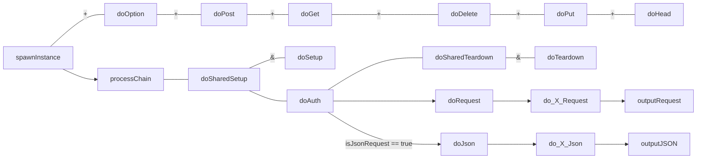

#Servlet


##CorePage

JavaCommons.servlet page core system, in which all additional pages are extended from. In addition, this is intentionally structured to be “usable” even without the understanding / importing of the various HttpServlet functionalities. Though doing so is still highly recommended.

corePage, and its sub page is designed to facilitate rapid servlet page creation, and extension across 3 distinct processing layers/roles : Authentication, Data, and output.

In addition, it has built in mechanism to facilitate the handling of JSON data request

Note that internally, doPost, doGet creates a new class instance for each call/request it receives. As such, all subclass built can consider all servlet instances are fresh instances on process request.

CorePage request process flow



Corepage lifecycle process flow

```flow
lcp1a=>operation: contextInitialized
lcp2a=>operation: doSharedSetup
lcp3a=>operation: initializeContext

lcp1a(right)->lcp2a(right)->lcp3a
```
```flow
lcp1b=>operation: contextDestroyed
lcp2b=>operation: doSharedTeardown
lcp3b=>operation: destroyContext

lcp1b(right)->lcp2b(right)->lcp3b
```


**Constructor**

+ CorePage()

**Methods Summary**

+ contextDestroyed(), contextInitialized(), destroyContext(), doAuth(), doDelete(), doDeleteJSON(), doDeleteRequest(), doException(), doGet(), doGetJSON(),
doGetRequest(), doJSON(), doOptions(), doPost(), doPostJSON(), doPostRequest(), doRequest(), doSetup(), doSharedSetup(), doSharedTeardown(), doTeardown(),
getContextPath(), getContextURI(), getHttpServletRequest(), getHttpServletResponse(), getOutputStream(), getParameter(), getServletContextURI(), getWriter(),
initializeContext(), initSetup(), isDELETE(), isGET(), isJsonRequest(), isOPTION(), isPOST(), isPUT(), outputFileServlet(), outputJSON(), outputJSONException(),
outputRequest(), outputRequestException(), processChain(), requestCookieMap(), requestHeaderMap(), requestParameters(), requestServletPath(), requestType(),
requestURI(), requestWildcardUri(), requestWildcardUriArray(), sendRedirect(), spawnInstance()




##CorePageAPI

Extends the core API page, to support APIs.


**Constructor**

+ CoreApiPage()

**Methods Summary**

+ apiBuilder(), apiBuilderSetup(), fileConfig(), getClassPath(), getConfigPath(), getLibraryPath(), getWebInfPath(), isJsonRequest(), outputJSON()




##RequestFileArray

Class map, that handles file uploads in a RequestList.


**Constructor**

+ RequestFileArray()

**Methods Summary**

+ get(), getByteArray(), getFileItem(), getInputStream(), getName(), iterator(), listIterator(), writeToFile()




##RequestMap

Class map, that handles the request map, and does the conversion between request arrays, and request values.

Also implements the generic convert class.


**Constructor**

+ RequestMap()
+ RequestMap(javax.servlet.http.HttpServletRequest req)
+ RequestMap(java.util.Map<java.lang.String,java.lang.Object> proxy)


