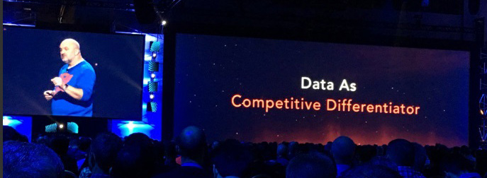
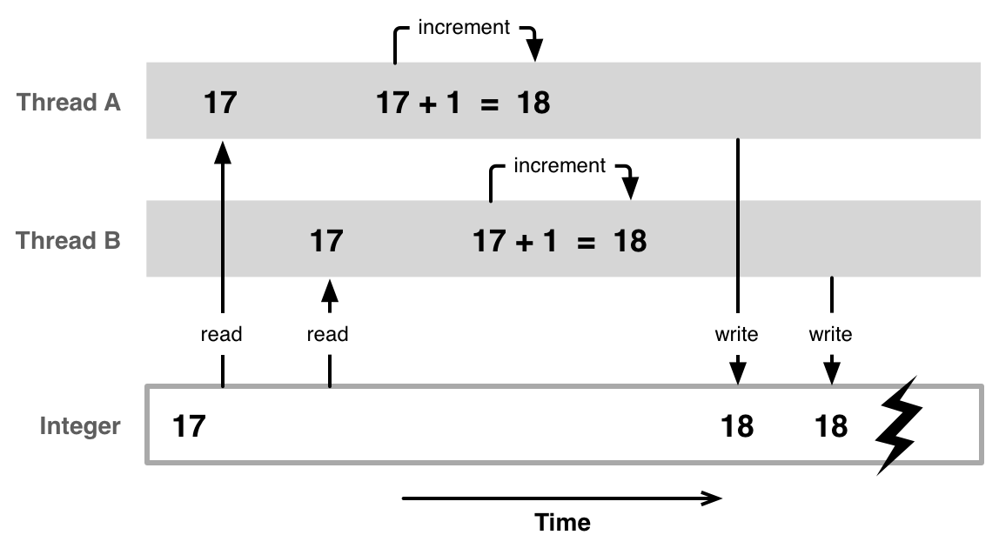

# [Concept] Data persistence levels in the data center

At the end of the day, all web applications can be broken down to `logic` built over `data`. In many ways `logic` is simply the tool used to either store or to read `data`.


It has reached to the point where `data is the new currency` or `competitive advantage` is thrown around as marketing buzz words for giant coporations. 

Think about it for a moment, one of the key reason why google is unstoppable in search, is due to the enromous amount of effort that is required to collect all the data used to build google search alone. Let alone engineer the search engine.


The point here your application logic is not king, `data is king`. And persist in many ways, and different levels in the data center.

To over generalize, there is a complex sliding scale of data speed vs persistence. However the devil is in the details in many cases. Where even the slowest persistant data can sometimes be faster, then an inefficent application.

Adapting the backend for these various levels of data persistency and performance forms the core of DataStack planning and concept.

## (Level 0): Request / Session / Transaction data
At the lowest level, data can persist for a fraction of, or an entire request session. This is equivalent of local working variables in functions or loops. Or pretty much all data inside a server API request, that is not stored outside the application logic.

> In other words, it hardly persist, and disappear in a blink of an eye.
>
> 

## (Level 1): Shared memory
Data here is stored and shared locally inside a single computer instance memory. It is reused across multiple API request. However data in this case is generally lost when the instance crashes. Such as through power failure.

> So still not very persistent, when someone trips over a wire.
>
> 

## (Level 2): Instance persistent disk
Data is stored into a disk, does not matter if its solid state or disk. So finally we are starting to have some real persistency, between server shutdowns. 

> It can survive a wire trip or two, or even survive a stumbling fool. But will it survive a DISK FAILURE?
>
> 

## (Level 3 or 3E): Cluster of instances
Data is stored and duplicated heavily across multiple instances, as such it does not matter if any instance fails for any reason. The system should automatically recover, and recreate any duplicates if needed onto new instances. 

For `Level 3`, Data is kept consistent, across multiple instances with a complex systems of low-latency programming locks. `Level 3E` accepts data lost due to `eventual consistency`

This refers to a cluster within the same region, to allow high bandwith and quick syncing of data across multiple instances, and strictly not on the same physical server. With cloud services, the last part is sometimes "hopefully" sadly.

> It can survive a server thrown out the window, or even a grenade or two. But can it survive a nuke?
>
> 

## (Level 4E): Multi-Region cluster
Data is duplicated and stored across multiple geographical regions. Due to the lower bandwith, and higher latency involved. Concepts such as `eventual consistency` becomes a required compromise in many cases.

At this level your application / company data is able to survive an entire region collapse. Assumingly the company is big enough that human personal is assumed to survives as well. (Hopefully you)

> It can survive a regional war, maybe north korea, but with eventual consistency and changes across the globe. Will it die to a race condition?
>
> 

## (Level 4): Consistent Multi-Region cluster
Forces consistency on writes, on a global level. This has potential ramification such as write operations taking over 200ms. 

The most common setup for this is for each segment of data, having a designated global master cluster. Which is then responsible for one way updates on all other clusters. This prevents the need for complex global [two phase commits](https://en.wikipedia.org/wiki/Two-phase_commit_protocol).

> At this point, (useful) data pretty much wins... Slowly, On this earth that is.
>
> 

